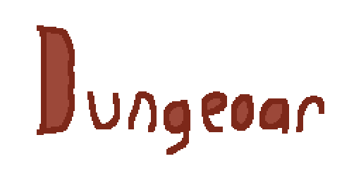

12/21/2022

---

  

<table>
<tbody>
<td align="center">
 
INFO: Hello! I am Clover, the 2nd owner of the game. Me and Michael have decided to make the game in Unity, instead of HTML5 and JavaScript. This would make multiplayer a lot easier, and would allow for native builds, not just a web version. The progress of the game will be shown in a bar below, and in the test builds out at the time. We are sorry for any inconveniences caused by this, and hope to see you in the test builds that will come out soon.

</td>
</tbody>
</table>

<b>PROGRESS:</b> 

<picture>
  <source media="(prefers-color-scheme: dark)" srcset=".github/bg.at.12.19.22.dark.png">
  <source media="(prefers-color-scheme: light)" srcset=".github/bg.at.12.19.22.png">
  
</picture>

Refer to the bar above for overall progress, otherwise use these:

A rogue-like, procedurally generated[^1], dungeon crawler. Will you survive in your journey for freedom, or perish on the way there?

TO-DO:

- [x] Finish player animations
- [ ] Finish inventory system
- [ ] Delete level 2 and add procedurally generated[^1] dungeons
- [ ] Re-add "levels", and add sections like caves, forest, etc.
 

Levels, which are most likely going to be procedurally generated, are going to be split into themes with acts. These are: 

<b>Base Game:</b>

| Act | Title                     | Theme                       |
|-----|---------------------------|-----------------------------|
| 0   | The Beginning             | Tutorial, Overworld, Forest |
| 1   | Undecided                 | Undecided                   |
| 2   | Undecided                 | Undecided                   |
| 3   | Undecided                 | Undecided                   |
| 4   | Undecided                 | Undecided                   |
| 5   | The Right To Be Forgotten | Ruins                       |
| 6   | Undecided                 | Undecided                   |
| 7   | Undecided                 | Undecided                   |
| 8   | Drowned Out               | Underwater                  |

 

<b>DLC (Into The Depths):</b>

| Act   | Title                  | Theme     |
|-------|------------------------|-----------|
| 9     | Undecided              | Undecided |
| 10    | Undecided              | Undecided |
| 11    | The Sins On Your Spine | Hell      |
| 11 ☠ | The Overtaker          | Inherits  |
| 12    | Undecided              | Undecided |
| 12 ☠ | The Dreamcatcher       | Inherits  | 

 

<b>DLC (Pain & Sorrow):</b>

| Act  | Title                  | Theme     |
|------|------------------------|-----------|
| 13   | Undecided              | Undecided |
| 14   | A Corrupted Shadow     | Undecided |
| 15   | The Cheat              | Undecided |
| 16   | The Death Toll         | Void      |
| 16 ☠| Death Himself          | Inherits  |
 

If you have a suggestion, please file an issue under the tag 'suggestion'

Releases:

[^1]: Concept. may not be in final release, and may be level-based, instead.

